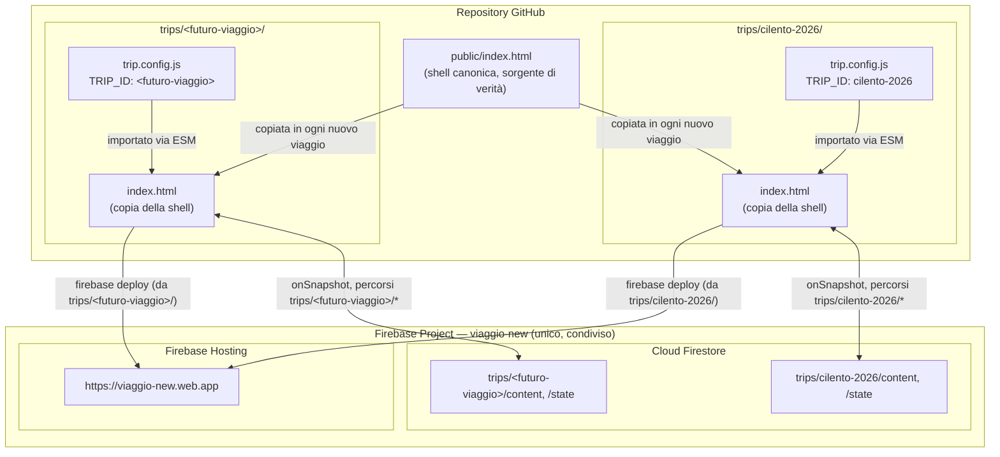
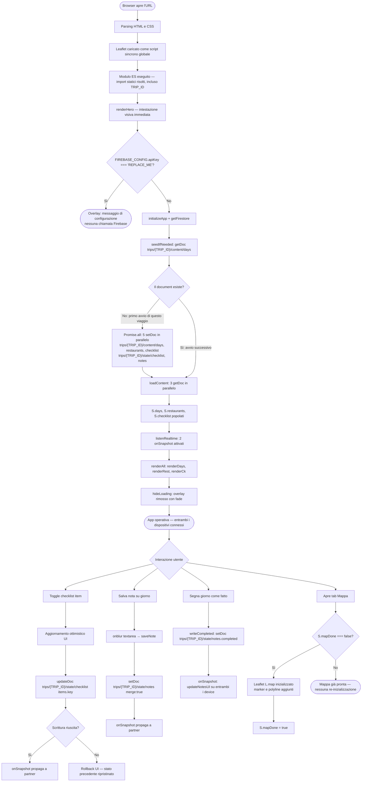
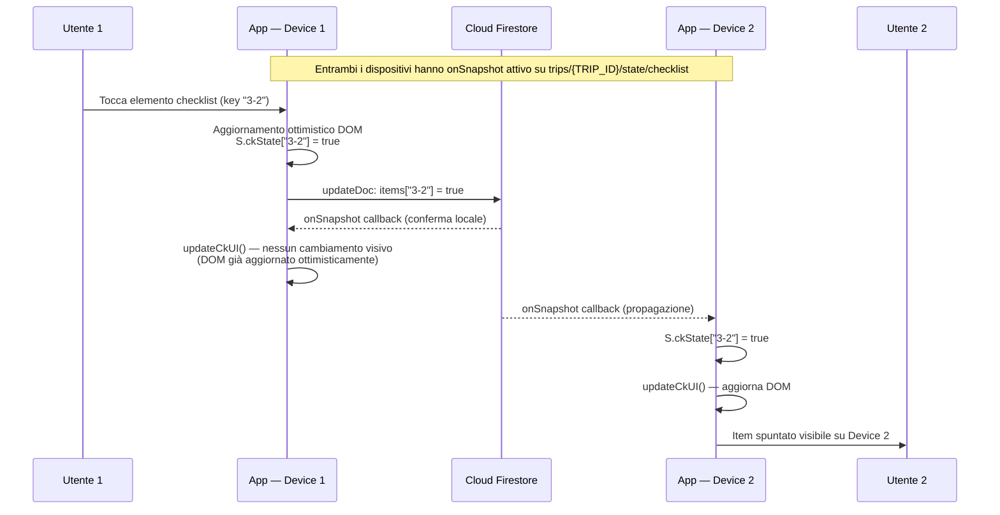

# Travel App — Documentazione Tecnica

**Versione:** 2.0.0
**Stack:** Vanilla JavaScript ES Modules · Firebase Firestore · Firebase Hosting · Leaflet.js
**Autore:** generato con Claude (Anthropic)

---

## Indice

1. [Panoramica del Sistema](#1-panoramica-del-sistema)
2. [Modello Architetturale](#2-modello-architetturale)
3. [Struttura del Repository](#3-struttura-del-repository)
4. [Layer di Configurazione — trip.config.js](#4-layer-di-configurazione--tripconfigjs)
5. [Application Shell — index.html](#5-application-shell--indexhtml)
6. [Modello dei Dati — Firebase Firestore](#6-modello-dei-dati--firebase-firestore)
7. [Flusso Applicativo Completo](#7-flusso-applicativo-completo)
8. [Sincronizzazione in Tempo Reale](#8-sincronizzazione-in-tempo-reale)
9. [Aggiungere un Nuovo Viaggio](#9-aggiungere-un-nuovo-viaggio)
10. [Versionamento su GitHub](#10-versionamento-su-github)
11. [Deployment](#11-deployment)
12. [Considerazioni di Sicurezza](#12-considerazioni-di-sicurezza)
13. [Note a Piè di Pagina](#13-note-a-piè-di-pagina)

---

## 1. Panoramica del Sistema

Questa applicazione è una *progressive web app* [^1] per la pianificazione condivisa di viaggi di coppia. Eroga un itinerario interattivo giorno per giorno, una mappa geografica delle tappe, un elenco di ristoranti per area e una checklist di preparazione sincronizzata in tempo reale tra due dispositivi distinti. Non esiste un backend proprietario per questa parte dell'applicazione: l'intera infrastruttura poggia sul piano gratuito di Firebase [^2] (Google), che fornisce sia il database che l'hosting statico.

La caratteristica distintiva del sistema è la separazione netta tra struttura applicativa e contenuto del viaggio. La struttura — tutta la logica di rendering, la gestione dello stato, l'inizializzazione di Firebase, i listener real-time — risiede in un'unica shell HTML che non viene mai modificata tra un viaggio e l'altro. Il contenuto — destinazioni, ristoranti, checklist, identificativo del viaggio, testi dell'intestazione — risiede in un secondo file JavaScript, `trip.config.js`, l'unico da scrivere per generare una nuova istanza dell'applicazione per un viaggio diverso. A partire dalla versione 2.0.0 la shell e il file di configurazione di ogni viaggio vivono insieme in una cartella dedicata sotto `trips/`, cosicché più viaggi, passati e futuri, coesistono fianco a fianco nello stesso repository invece che su branch separati.

---

## 2. Modello Architetturale

Il sistema è organizzato su tre layer distinti e indipendenti tra loro: il *layer di configurazione*, il *layer di presentazione* e il *layer di persistenza e sincronizzazione*.

Il *layer di configurazione* è `trip.config.js`. Esporta cinque oggetti/valori JavaScript che descrivono completamente un singolo viaggio: l'identificativo univoco del viaggio (`TRIP_ID`), le credenziali del progetto Firebase condiviso, i metadati dell'intestazione visiva, le coordinate geografiche dei marker sulla mappa e la struttura dati completa (giorni, ristoranti, checklist). Questo file è l'unica variabile nel sistema tra un viaggio e l'altro.

Il *layer di presentazione* è `index.html`. Contiene tutto il CSS, tutta la struttura HTML della shell e tutto il codice JavaScript di orchestrazione. Importa il layer di configurazione tramite il meccanismo nativo degli *ECMAScript Modules* [^3] e si occupa esclusivamente di leggere i dati — prima da `trip.config.js`, poi da Firestore — e di renderizzarli nel DOM [^4].

Il *layer di persistenza e sincronizzazione* è Firebase, composto da due servizi distinti: *Cloud Firestore* (database NoSQL [^5] documentale, real-time) per i dati e lo stato condiviso, e *Firebase Hosting* per l'erogazione del file HTML tramite URL [^6] pubblico su rete HTTPS [^7]. A differenza della versione 1.0.0, un solo progetto Firebase serve tutti i viaggi: la separazione dei dati tra viaggi diversi avviene dentro lo stesso Firestore, tramite `TRIP_ID` (sezione 6), non tramite progetti Firebase distinti.



---

## 3. Struttura del Repository

```
holiday-template/
├── public/
│   └── index.html            ← shell canonica, sorgente di verità; si copia, non si linka
├── trips/
│   └── cilento-2026/
│       ├── index.html        ← copia della shell canonica per questo viaggio
│       ├── trip.config.js    ← configurazione di questo viaggio; unico file da scrivere
│       ├── firebase.json     ← hosting Firebase per questo viaggio (public: ".")
│       └── .firebaserc       ← binding locale al progetto Firebase, gitignored
├── services/
│   └── flight-search/        ← backend Fase 1 della roadmap funzionalità (sezione roadmap.md)
├── .gitignore
└── README.md                 ← questo documento
```

Ogni cartella sotto `trips/` è autosufficiente: contiene una propria copia della shell, un proprio file di configurazione e un proprio `firebase.json`, ed è deployabile indipendentemente dalle altre con il comando `firebase deploy` lanciato dalla cartella stessa. `public/index.html` non viene mai deployato direttamente: è il punto da cui si copia la shell quando si crea un nuovo viaggio, e il solo posto dove si applica una correzione o un miglioramento della shell prima di ripropagarlo alle cartelle dei viaggi esistenti.

`firebase.json` di ogni viaggio istruisce Firebase Hosting a servire i file dalla cartella corrente (`"public": "."`, perché `index.html` e `trip.config.js` stanno direttamente dentro `trips/<nome>/`, non in una sottocartella ulteriore) e a redirezionare tutte le richieste verso `index.html`:

```json
{
  "hosting": {
    "public": ".",
    "ignore": ["firebase.json", "**/.*", "**/node_modules/**", "_trip-notes/**"],
    "rewrites": [{ "source": "**", "destination": "/index.html" }]
  }
}
```

`.firebaserc`, generato da `firebase use --add` (o creato a mano con lo stesso contenuto), contiene il binding tra la cartella del viaggio e il progetto Firebase. È escluso da Git perché è dato di configurazione locale, non perché contenga segreti: essendo lo stesso progetto Firebase condiviso da tutti i viaggi (sezione 6), il suo contenuto è identico in ogni cartella `trips/<nome>/.firebaserc`.

Una cartella `_trip-notes/` (facoltativa, non ancora presente per Cilento) può convivere dentro la cartella di un viaggio per appunti o dati grezzi specifici di quella vacanza: è ignorata sia da Git sia dal deploy Firebase, sullo stesso principio del `_notes/` di radice.

---

## 4. Layer di Configurazione — `trip.config.js`

`trip.config.js` è un modulo JavaScript standard che usa la sintassi `export` di ES Modules per esporre cinque valori distinti. Ognuno ha una responsabilità precisa e corrisponde a una parte specifica del sistema.

### 4.1 TRIP_ID

Identificativo univoco del viaggio, stringa breve senza spazi (es. `"cilento-2026"`). Non ha una controparte visiva: serve esclusivamente come prefisso dei percorsi Firestore (sezione 6), per permettere a più viaggi di condividere lo stesso progetto Firebase senza che i loro dati si sovrascrivano a vicenda.

```javascript
export const TRIP_ID = "cilento-2026";
```

### 4.2 FIREBASE_CONFIG

Contiene le credenziali del progetto Firebase. Questi valori sono recuperabili dalla Firebase Console sotto *Impostazioni progetto > Le tue app > SDK setup and configuration*. A differenza di `TRIP_ID`, questo oggetto è **identico in ogni viaggio**: un solo progetto Firebase (`viaggio-new`, sezione 6) serve tutta l'applicazione, presente e futura.

```javascript
export const FIREBASE_CONFIG = {
  apiKey:            "REPLACE_ME",
  authDomain:        "viaggio-new.firebaseapp.com",
  projectId:         "viaggio-new",
  storageBucket:     "REPLACE_ME",
  messagingSenderId: "REPLACE_ME",
  appId:             "REPLACE_ME"
};
```

Al momento dell'inizializzazione, `index.html` chiama `initializeApp(FIREBASE_CONFIG)` passando questo oggetto all'SDK [^9] Firebase. Prima di farlo, verifica che `apiKey` non sia ancora il valore placeholder `"REPLACE_ME"`: se lo è, interrompe l'esecuzione e mostra un messaggio diagnostico nell'overlay di caricamento, evitando che l'applicazione tenti una connessione con credenziali non valide.

### 4.3 TRIP_META

Contiene il contenuto testuale dell'intestazione visiva dell'applicazione: il badge, il titolo principale, il sottotitolo in corsivo e l'array delle statistiche sintetiche.

```javascript
export const TRIP_META = {
  badge:    "Viaggio di Coppia · Estate 2025",
  title:    "Cilento &amp; Caserta",
  subtitle: "7 giorni tra mare, natura e storia",
  stats:    ["📅 7 giorni · 6 notti", "🏨 1 solo cambio hotel", ...]
};
```

Questa separazione consente a `index.html` di renderizzare l'intestazione immediatamente al caricamento, prima ancora che Firebase risponda, perché `renderHero()` viene invocata come prima istruzione di `init()` e non dipende da alcuna chiamata asincrona.

### 4.4 MAP_LOCATIONS

Array di oggetti che descrivono i marker della mappa Leaflet [^10]. Ogni oggetto definisce coordinate geografiche (`lat`, `lng`), nome visualizzato (`nm`), sottotitolo (`sub`), colore esadecimale del marker (`c`) ed emoji sovrapposta al cerchio del marker (`em`).

La sequenza dell'array rispecchia l'ordine cronologico delle tappe: Leaflet disegna la linea tratteggiata del percorso connettendo i punti nell'ordine in cui compaiono nell'array, tramite `L.polyline(MAP_LOCATIONS.map(l => [l.lat, l.lng]), ...)`.

### 4.5 TRIP_DATA

Contiene la struttura dati completa del viaggio, suddivisa in tre sotto-array: `days`, `restaurants` e `checklist`. Questa struttura viene caricata su Firestore al primo avvio dell'applicazione (meccanismo di *seeding* descritto nel paragrafo 7.2). Ogni elemento di `days` include un identificatore numerico progressivo (`id`), un colore tema, icona, etichetta, titolo, luoghi, sezioni descrittive, suggerimenti pratici e stime di costo per pasti e attività. Ogni elemento di `checklist` raggruppa gli item sotto una categoria (`cat`) e li lista come oggetti con testo (`t`) e nota opzionale (`n`).

---

## 5. Application Shell — `index.html`

`index.html` è strutturato in tre blocchi sequenziali: il markup HTML della shell visiva, il tag `<script src>` che carica Leaflet come script sincrono globale, e il tag `<script type="module">` che contiene tutta la logica applicativa in un modulo ES isolato.

### 5.1 Il tag `<script type="module">` e la catena di import

La prima istruzione eseguita dal modulo è un blocco di tre `import` statici:

```javascript
import { initializeApp }
  from 'https://www.gstatic.com/firebasejs/10.12.2/firebase-app.js';

import { getFirestore, doc, getDoc, setDoc, onSnapshot, updateDoc }
  from 'https://www.gstatic.com/firebasejs/10.12.2/firebase-firestore.js';

import { FIREBASE_CONFIG, TRIP_META, TRIP_DATA, MAP_LOCATIONS, TRIP_ID }
  from './trip.config.js';
```

I primi due import scaricano l'SDK Firebase direttamente dalla CDN [^11] di Google tramite URL assoluti. Il terzo import risolve `trip.config.js` come percorso relativo rispetto a `index.html`: poiché entrambi i file si trovano nella stessa cartella `trips/<nome>/`, il browser li carica correttamente sia in ambiente di sviluppo locale che da Firebase Hosting.

L'uso di `type="module"` implica tre comportamenti automatici del browser rilevanti per questo sistema: i moduli sono sempre *deferred* (eseguiti dopo il parsing completo del DOM), hanno scope isolato (le variabili non inquinano il namespace globale) e supportano nativamente la sintassi `import/export`. Le funzioni che devono essere accessibili dagli handler `onclick` dell'HTML — dove il module scope non è raggiungibile — vengono esplicitamente assegnate a `window.*` nella sezione finale del modulo.

### 5.2 Stato applicativo

Lo stato in memoria è un unico oggetto `S` dichiarato a livello di modulo:

```javascript
const S = {
  days: [], restaurants: [], checklist: [],  // contenuto da Firestore
  ckState: {},   // mappa key→boolean per la checklist, sincronizzata via onSnapshot
  notes: {},     // mappa dayId→string per le note, sincronizzata via onSnapshot
  completed: {}, // mappa dayId→boolean per i giorni segnati come fatti
  mapDone: false // flag per inizializzare Leaflet una sola volta
};
```

Questo oggetto è la singola fonte di verità in memoria. I listener `onSnapshot` lo aggiornano ogni volta che Firestore notifica una modifica e invocano le funzioni di aggiornamento del DOM corrispondenti.

---

## 6. Modello dei Dati — Firebase Firestore

Firestore è un database NoSQL documentale organizzato in *collections* e *documents*. Ogni document è un oggetto JSON con campi arbitrari. Dalla versione 2.0.0 il sistema usa cinque document per viaggio, tutti annidati sotto la collection di primo livello `trips/{TRIP_ID}`, dove `TRIP_ID` è il valore esportato da `trip.config.js` (sezione 4.1):

```
firestore-root/
└── trips/
    └── {TRIP_ID}/                 → es. "cilento-2026"
        ├── content/
        │   ├── days           → { data: [...array dei giorni] }
        │   ├── restaurants    → { data: [...array delle aree ristoranti] }
        │   └── checklist      → { data: [...array delle categorie checklist] }
        └── state/
            ├── checklist      → { items: { "0-0": true, "1-3": false, ... } }
            └── notes          → { days: { "1": "testo nota", ... },
                                    completed: { "2": true, ... } }
```

Questo namespace per viaggio è la ragione per cui un solo progetto Firebase (sezione 4.2) può ospitare tutti i viaggi, presenti e futuri, senza che i dati di uno sovrascrivano quelli di un altro: due viaggi con `TRIP_ID` diversi scrivono su rami completamente separati dell'albero Firestore. Il costo accettato di questa scelta è che tutti i viaggi condividono la stessa quota giornaliera gratuita di Firestore (50.000 letture e 20.000 scritture al giorno sul piano *Spark*), quota ampiamente sufficiente per un uso privato tra due persone anche con più viaggi attivi in parallelo.

La collection `content` contiene i dati strutturali del viaggio e viene scritta una sola volta (al primo avvio) e letta ad ogni caricamento successivo. La collection `state` contiene lo stato interattivo condiviso e viene aggiornata in scrittura ad ogni interazione utente e in lettura continua tramite listener real-time.

La chiave usata per identificare i singoli item della checklist in `state/checklist.items` è una stringa composita nel formato `"<indice_categoria>-<indice_item>"`, generata dinamicamente durante `renderCk()`. Ad esempio, `"2-4"` identifica il quinto elemento (indice 4) della terza categoria (indice 2). Questa convenzione mantiene il modello piatto e rende ogni aggiornamento atomico: scrivere `items["2-4"] = true` modifica un solo campo del documento senza sovrascrivere lo stato degli altri item.

---

## 7. Flusso Applicativo Completo

Il diagramma seguente copre tutte le casistiche del ciclo di vita dell'applicazione, dalla prima apertura alle interazioni utente successive. I percorsi Firestore mostrati includono il prefisso `trips/{TRIP_ID}` introdotto in sezione 6.



### 7.1 Fase di Inizializzazione

Quando il browser carica `index.html`, il parser HTML incontra il tag `<script src="...leaflet.min.js">` privo di attributi `defer` o `async` e lo esegue in modo sincrono, rendendo disponibile l'oggetto globale `L` prima che qualsiasi altro script venga eseguito. Subito dopo, incontra `<script type="module">` che viene automaticamente *deferred*: il modulo viene scaricato in parallelo ma eseguito solo a parsing del documento completato.

Il modulo parte risolvendo i tre `import` statici. I due import Firebase scaricano i moduli dell'SDK dalla CDN di Google; il terzo import carica `trip.config.js` dalla stessa origine, incluso il valore `TRIP_ID` usato da qui in poi in ogni percorso Firestore. Solo dopo che tutti e tre i moduli sono stati risolti, l'esecuzione del corpo del modulo inizia con la chiamata a `init()`.

`init()` invoca immediatamente `renderHero()`, che legge `TRIP_META` — già disponibile in memoria perché importato staticamente — e scrive l'HTML dell'intestazione nel DOM senza aspettare nessuna risposta di rete. Il risultato è che l'utente vede il titolo del viaggio prima ancora che Firebase risponda, riducendo la percezione di latenza.

### 7.2 Seeding Automatico al Primo Avvio

`seedIfNeeded()` esegue un singolo `getDoc` sul document `trips/{TRIP_ID}/content/days`. Se il document non esiste, è il segnale che questo specifico viaggio non ha ancora dati su Firestore e che l'applicazione viene aperta per la prima volta per quel `TRIP_ID`. In questo caso, cinque `setDoc` vengono lanciati in parallelo tramite `Promise.all`:

```javascript
async function seedIfNeeded() {
  const snap = await getDoc(doc(db, 'trips', TRIP_ID, 'content', 'days'));
  if (snap.exists()) return; // dati di questo viaggio già presenti, nessuna scrittura
  await Promise.all([
    setDoc(doc(db, 'trips', TRIP_ID, 'content', 'days'),        { data: TRIP_DATA.days }),
    setDoc(doc(db, 'trips', TRIP_ID, 'content', 'restaurants'), { data: TRIP_DATA.restaurants }),
    setDoc(doc(db, 'trips', TRIP_ID, 'content', 'checklist'),   { data: TRIP_DATA.checklist }),
    setDoc(doc(db, 'trips', TRIP_ID, 'state',   'checklist'),   { items: {} }),
    setDoc(doc(db, 'trips', TRIP_ID, 'state',   'notes'),       { days: {}, completed: {} }),
  ]);
}
```

La chiamata `Promise.all` riduce il tempo di seed da cinque latenze di rete sequenziali a una sola latenza parallela. I document `state/checklist` e `state/notes` vengono inizializzati con strutture vuote per garantire che i successivi `updateDoc` — che presuppongono l'esistenza del document — non falliscano.

Una condizione di *race* è teoricamente possibile: se due dispositivi aprono l'applicazione simultaneamente per la prima volta sullo stesso `TRIP_ID`, entrambi possono eseguire `seedIfNeeded()` prima che l'altro abbia completato la scrittura. In questo caso, il seed viene eseguito due volte, ma con dati identici: Firestore applica l'ultima scrittura e il risultato finale è corretto. Non si verifica corruzione né perdita di dati.

### 7.3 Caricamento dal Database

`loadContent()` legge i tre document della collection `content` di questo viaggio in parallelo e popola `S.days`, `S.restaurants` e `S.checklist`. Questi dati non cambiano durante la sessione. Se il contenuto del viaggio viene modificato dalla Firebase Console, la modifica diventa visibile al prossimo caricamento della pagina.

### 7.4 Attivazione dei Listener Real-Time

`listenRealtime()` attiva due listener `onSnapshot` che rimangono attivi per tutta la durata della sessione, entrambi sotto il namespace `trips/{TRIP_ID}` di questo viaggio. Il primo monitora `state/checklist`, il secondo monitora `state/notes`. `onSnapshot` mantiene una connessione WebSocket persistente con Firestore. Ogni modifica al document — da qualsiasi dispositivo — scatena la callback entro poche decine di millisecondi. I listener sono attivi su entrambi i dispositivi in parallelo: questo è il meccanismo che garantisce la sincronizzazione in tempo reale.

### 7.5 Interazioni Utente

**Checklist:** quando l'utente tocca un item, `ckTog()` esegue immediatamente un aggiornamento ottimistico del DOM — l'item cambia aspetto senza aspettare la conferma di rete — e parallelamente invia `updateDoc` a Firestore con il nuovo valore booleano nel campo `items["<key>"]`. Se la scrittura fallisce (assenza di rete, errore di regola di sicurezza), un blocco `catch` ripristina il DOM allo stato precedente e registra l'errore in console. Se ha successo, `onSnapshot` sul partner propaga automaticamente l'aggiornamento.

**Note sui giorni:** `saveNote()` viene invocata dall'evento `onblur` del textarea, cioè quando l'utente sposta il focus fuori dall'area di testo. Esegue `setDoc` con l'opzione `{ merge: true }`, che aggiorna solo il campo specificato all'interno del documento senza sovrascrivere gli altri campi esistenti. Dopo la scrittura, mostra brevemente la label "✓ Salvato" per due secondi.

**Giorno completato:** `markDone()` legge lo stato corrente da `S.completed[dayId]`, lo inverte e scrive il valore aggiornato con `setDoc` merge su `state/notes.completed`. L'`onSnapshot` del secondo listener riceve la modifica e invoca `updateNotesUI()` su entrambi i dispositivi, aggiornando badge, pulsante e opacità della card.

---

## 8. Sincronizzazione in Tempo Reale

Il diagramma seguente descrive la sequenza precisa di eventi che si verifica quando un utente toglie un elemento dalla checklist mentre il partner ha l'applicazione aperta su un secondo dispositivo, sullo stesso viaggio.



Il punto critico è che l'aggiornamento ottimistico su Device 1 e la propagazione su Device 2 avvengono attraverso lo stesso meccanismo (`onSnapshot`), ma con latenze diverse: Device 1 aggiorna il DOM in modo sincrono prima della scrittura, Device 2 aggiorna il DOM solo dopo che Firestore ha ricevuto e propagato la modifica. In condizioni normali di rete mobile (latenza 50–200ms), l'esperienza su Device 2 è percepita come istantanea.

L'SDK Firestore gestisce internamente la coda delle scritture offline: se Device 1 perde la connessione mentre l'utente toglie elementi dalla checklist, le modifiche vengono accumulate localmente e trasmesse a Firestore non appena la connessione si ripristina. L'aggiornamento ottimistico garantisce che l'interfaccia rimanga coerente anche durante questa finestra offline.

---

## 9. Aggiungere un Nuovo Viaggio

Creare una nuova istanza dell'applicazione per un viaggio diverso è un'operazione che non richiede modifiche a `public/index.html`, ai `firebase.json` esistenti o alla shell di alcun viaggio già creato. La procedura, a differenza della versione 1.0.0 di questo documento, non usa branch Git: ogni viaggio è una sotto-cartella permanente di `trips/`, visibile e navigabile insieme a tutti gli altri sullo stesso branch `main`.

Prima operazione: crea `trips/<nuovo-nome>/` (es. `trips/tokyo-2026/`) copiando `public/index.html` al suo interno come `index.html`. Copia anche un `firebase.json` con lo stesso contenuto mostrato in sezione 3.

Seconda operazione: scrivi `trips/<nuovo-nome>/trip.config.js` da zero, sul modello di `trips/cilento-2026/trip.config.js`. Imposta un `TRIP_ID` nuovo e univoco (es. `"tokyo-2026"`) e lascia `FIREBASE_CONFIG` identico a quello degli altri viaggi: è lo stesso progetto Firebase condiviso (`viaggio-new`), quindi non serve crearne uno nuovo né richiedere nuove credenziali. Modifica poi `TRIP_META`, `MAP_LOCATIONS` e `TRIP_DATA.days / .restaurants / .checklist` con i contenuti del nuovo viaggio; la struttura degli oggetti rimane identica, cambiano solo i valori.

Terza operazione: dentro `trips/<nuovo-nome>/`, esegui `firebase use --add` per collegare la cartella al progetto Firebase esistente (crea il file `.firebaserc` locale, gitignored, con lo stesso project id degli altri viaggi), poi `firebase deploy`. Al primo accesso all'URL generato, `seedIfNeeded()` (sezione 7.2) rileverà che `trips/{TRIP_ID}/content/days` non esiste ancora per questo nuovo `TRIP_ID` e popolerà Firestore con i nuovi dati, senza toccare quelli di nessun altro viaggio.

Se in futuro la shell canonica (`public/index.html`) riceve una correzione o un miglioramento, va ripropagata manualmente copiandola sopra l'`index.html` di ogni cartella `trips/<nome>/` che si vuole aggiornare: non esiste un meccanismo di import a runtime tra `public/` e `trips/`, per scelta, in modo che ogni viaggio resti deployabile in modo indipendente e stabile anche se la shell canonica evolve.

---

## 10. Versionamento su GitHub

La struttura del repository è concepita per il versionamento con Git. Il file `.gitignore` esclude intenzionalmente: `.firebaserc` e `.firebase/` (binding locale al progetto Firebase e cache della CLI, pattern applicati a qualunque profondità quindi validi sotto ogni `trips/<nome>/`), `node_modules/` (dipendenze installate localmente se si usa npm per la CLI), `_notes/` e `_trip-notes/` (livello privato e verboso, generale e per singolo viaggio).

A differenza della versione 1.0.0, non esiste più una strategia di branch-per-viaggio: `main` ospita simultaneamente `public/` (la shell canonica) e tutte le cartelle `trips/<nome>/`, passate e future. Questo mantiene uno storico navigabile su disco, in una singola working copy, senza dover cambiare branch per confrontare i dati di due viaggi diversi.

Se si vuole che il repository sia privato — scelta raccomandata poiché `trip.config.js` contiene le credenziali Firebase — GitHub offre repository private gratuite per account personali senza limitazioni di numero.

Per condividere l'accesso alla repository con il partner, la funzione *Collaborators* di GitHub (sotto *Settings > Collaborators and teams*) consente di aggiungere un secondo utente con permessi di lettura o scrittura. Questo permette a entrambi di aprire il codice, di modificare `trip.config.js` per aggiornare note o ristoranti e di fare push — operazione che però richiede un nuovo `firebase deploy` dalla cartella del viaggio interessato per rendere le modifiche visibili nell'applicazione.

---

## 11. Deployment

Il deployment si esegue con Firebase CLI, uno strumento a riga di comando installabile tramite `npm install -g firebase-tools`. Una volta installato, richiede una sola autenticazione con account Google (`firebase login`) e poi opera autonomamente. A differenza della versione 1.0.0, i comandi si eseguono dalla cartella del singolo viaggio, non dalla radice del repository, perché ogni viaggio ha il proprio `firebase.json`.

La sequenza completa per il primo deploy di un nuovo viaggio è:

```bash
npm install -g firebase-tools        # installa Firebase CLI globalmente, una tantum
firebase login                       # autenticazione Google (si apre il browser), una tantum
cd trips/<nome-viaggio>
firebase use --add                   # collega la cartella al progetto Firebase condiviso "viaggio-new"
                                      # (stesso project id di tutti gli altri viaggi)
firebase deploy                      # carica il contenuto della cartella su Firebase Hosting
```

`firebase deploy` comprime e carica tutti i file dentro la cartella del viaggio su Firebase Hosting, assegna un hash di versione a ciascun file e aggiorna l'URL di produzione in modo atomico. Il comando stampa l'URL finale nella forma `https://<project-id>.web.app`. Poiché tutti i viaggi condividono lo stesso progetto Firebase, l'URL di Hosting è condiviso: l'ultimo `firebase deploy` eseguito, da qualunque cartella `trips/<nome>/`, è quello che risulta pubblicato su quell'URL. I dati Firestore di ogni viaggio restano invece intatti indipendentemente da quale viaggio sia attualmente pubblicato in Hosting, perché namespacizzati per `TRIP_ID` (sezione 6).

Per aggiornamenti frequenti al solo contenuto del viaggio (ad esempio modificare la descrizione di un ristorante), è più efficiente intervenire direttamente dalla Firebase Console sui document della collection `trips/{TRIP_ID}/content`, evitando del tutto un nuovo deploy.

---

## 12. Considerazioni di Sicurezza

Firebase Hosting eroga i file su HTTPS con certificato TLS gestito automaticamente da Google senza costi aggiuntivi. La comunicazione tra i dispositivi e Firestore avviene attraverso WebSocket sicuri sulla stessa infrastruttura.

Le credenziali in `FIREBASE_CONFIG` — in particolare `apiKey` — non sono un segreto nel senso tradizionale del termine. Sono visibili nel sorgente JavaScript e in alcun modo offuscabili in un'applicazione client-side. La sicurezza in Firebase non si fonda sulla segretezza dell'API key, ma sulle *Firestore Security Rules*: regole dichiarative che definiscono chi può leggere e scrivere quale document. Per questa applicazione, il piano gratuito *Spark* attiva la modalità test con regole permissive che scadono automaticamente dopo 30 giorni. Prima della scadenza, occorre aggiornare le regole dalla Firebase Console (*Firestore > Regole*) con una configurazione permanente. Per un uso personale privato tra due persone con un URL non pubblico, le regole seguenti sono sufficienti:

```javascript
rules_version = '2';
service cloud.firestore {
  match /databases/{database}/documents {
    match /{document=**} {
      allow read, write: if true;
    }
  }
}
```

Queste regole consentono lettura e scrittura a chiunque abbia l'URL dell'applicazione. Per un uso esclusivamente privato, con un URL non indicizzato e non distribuito pubblicamente, il rischio è accettabile. Va notato che, essendo il progetto Firebase ora condiviso da tutti i viaggi, queste regole permissive valgono per l'intero albero `trips/**`, non solo per il viaggio attivo: chiunque conosca l'URL può leggere e scrivere i dati di qualunque viaggio, passato o futuro. Se si desidera una protezione più granulare, Firebase Authentication consente di vincolare le regole a specifici account Google autenticati, ma richiede l'aggiunta dell'SDK di autenticazione e una logica di login nell'applicazione.

---

## 13. Note a Piè di Pagina

[^1]: **PWA** — Progressive Web App. Applicazione web che sfrutta le API moderne del browser per offrire un'esperienza simile a quella di un'applicazione nativa: installabile su homescreen, accessibile offline (con service worker), responsive. In questa implementazione non è presente un service worker esplicito; il termine è usato in senso lato per indicare un'applicazione web moderna fruibile da dispositivi mobili.

[^2]: **Firebase** — Piattaforma Backend-as-a-Service di Google che raggruppa servizi cloud come database real-time (Firestore), autenticazione, hosting statico, storage di file e funzioni serverless. Il piano gratuito *Spark* include: 1 GB di storage Firestore, 10 GB/mese di trasferimento su Hosting, 50.000 letture e 20.000 scritture al giorno su Firestore.

[^3]: **ESM** — ECMAScript Modules. Sistema di moduli nativo JavaScript introdotto con ES2015 (ES6). Permette di suddividere il codice in file distinti con `export` e `import` espliciti, risolti dal browser senza necessità di bundler. Attivato nei browser tramite `<script type="module">`.

[^4]: **DOM** — Document Object Model. Rappresentazione ad albero del documento HTML mantenuta in memoria dal browser. JavaScript interagisce con la pagina tramite le API del DOM, leggendo e modificando nodi, attributi e stili.

[^5]: **NoSQL** — Not Only SQL. Categoria di database che si discosta dal modello relazionale (tabelle con schema fisso). Firestore è un database documentale: i dati sono organizzati in documenti JSON annidati all'interno di collection, senza schema imposto.

[^6]: **URL** — Uniform Resource Locator. Indirizzo che identifica univocamente una risorsa su rete, nella forma `https://dominio.tld/percorso`. In questo contesto, Firebase Hosting assegna automaticamente un URL nella forma `https://<project-id>.web.app`.

[^7]: **HTTPS** — HyperText Transfer Protocol Secure. Versione cifrata di HTTP che usa TLS (Transport Layer Security) per cifrare la comunicazione tra browser e server, garantendo riservatezza e integrità dei dati trasmessi. Obbligatorio per le applicazioni che usano API moderne del browser.

[^8]: **CLI** — Command-Line Interface. Interfaccia a riga di comando. Firebase CLI è il tool ufficiale installabile tramite npm che permette di gestire progetti Firebase da terminale: autenticazione, configurazione, deploy, gestione delle regole.

[^9]: **SDK** — Software Development Kit. Insieme di librerie, strumenti e documentazione che semplificano l'integrazione con un servizio esterno. L'SDK Firebase per JavaScript espone funzioni come `initializeApp`, `getFirestore`, `onSnapshot` che astraggono le chiamate HTTP REST sottostanti all'API Firestore.

[^10]: **Leaflet** — Libreria JavaScript open-source per mappe interattive. Versione 1.9.4, caricata da CDN Cloudflare come script sincrono. Espone l'oggetto globale `L` da cui si istanziano mappe, marker, livelli tile e geometrie vettoriali.

[^11]: **CDN** — Content Delivery Network. Rete di server distribuiti geograficamente che eroga risorse statiche (script, immagini, font) dal nodo fisicamente più vicino all'utente, riducendo la latenza di download. Sia Firebase SDK che Leaflet e Google Fonts vengono caricati da CDN in questa applicazione.
